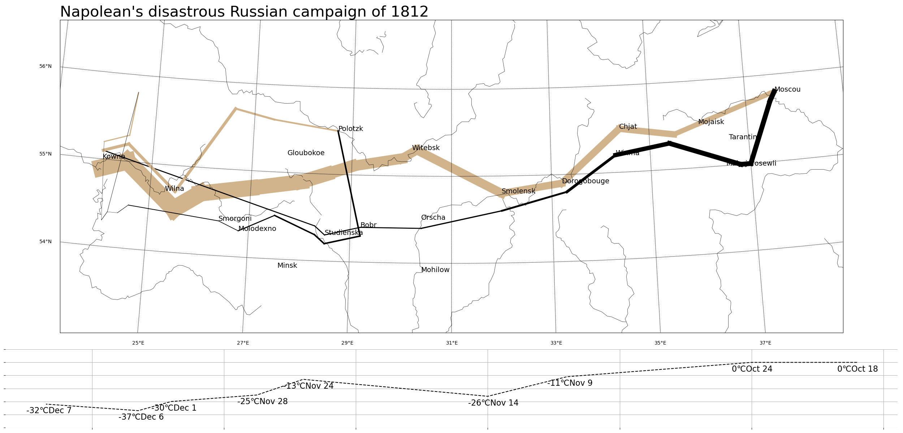

# 拿破崙征俄戰爭

## 簡介
此專案「拿破崙征俄戰爭」復刻了 [Charles Minard's Napoleon's disastrous Russian campaign of 1812](https://en.wikipedia.org/wiki/Charles_Joseph_Minard#/media/File:Minard.png) 資料視覺化，使用了 `pandas` 與 `sqlite3` 建立了資料庫，用 `matplotlib` 與 `basemap` 驗證並做出成品。

## 如何重現

- 安裝 [Miniconda](https://docs.anaconda.com/miniconda)
- 依據  `environment.yml` 建立環境:

```
conda env create -f environment.yml
```

- 將 `data/` 資料夾中的 `minard.txt` 放到 `data/` 資料夾中
- 啟動環境並執行 `python create_minard_db.py` 可以在 `data/` 建立 `minard.db`
- 啟動環境並執行 `python plot_with_basemap.py` 可以生成出 `minard_clone.png`

